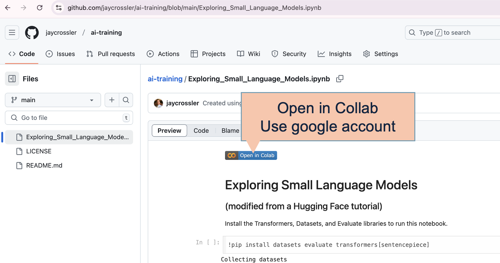
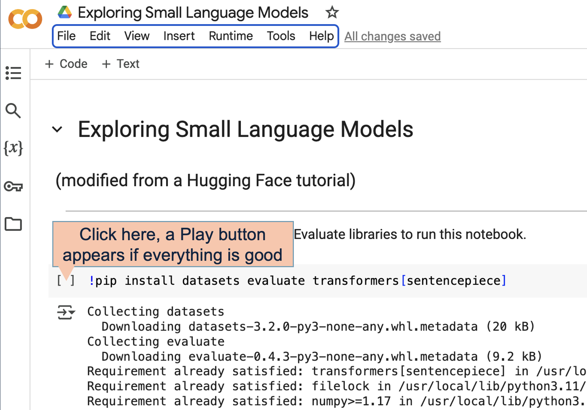

# AI Playground and training helpers

> Join me in learning hands-on methods for building actual AI systems, integrating local Small Language Models, building AI Agents, and integrating with larger cloud-hosted Large Language Models.  Code is presented to help maximize reuse - so that you can either learn the concepts, or use them within your own applications and systems.

## Welcome to the AI mini "courses"!

All of these examples are living documents of AI techniques - updated so that you can follow along, run code and apps yourself (without having to install software onto your machine), and learn the details of how to employ AI solutions in real world software.  Most are taken from other good notebooks and examples, then tweaked or repaired as code evolves. All credit should go to the original thinkers.

### Python Notebooks for examples ###

All the items that start with **Notebook** are Python Notebooks that can either be run in [Google Colab](https://colab.research.google.com/) or locally (either by setting up Notebooks locally or copying the Python directly into a local file). If you run them on Google Colab, you need a google colab account (free). When you run a notebook in colab, it spawns a server in the cloud and *usually* assigns GPU time to that server. If you use it heavily, you might need to load $10 or so into your Colab account to pay for more server time, but that shouldn't be necessary if you are just running these modules.

</a>
</a>

| | | |
|--|--|--|
||[Notebook 1: Exploring Small Models](Exploring_Small_Language_Models.ipynb) |Point to a very small (250Mb) model and perform basic queries and AI language tricks on it (like sentence classification or translation). |
||[Notebook 2: Ollama and Pydantic](Ollama%20and%20pydantic.ipynb)|Set up a local SLM (or a few of them) using ollama, then use the Pydantic python framework to access it.|
||[Notebook 3: Querying OpenAI remotely](Accessing_OpenAI_via_API.ipynb) |Send queries to OpenAI through python, receive 'structured' responses (to use in apps) **Requires: OpenAI API Key (not pro account)** |
||[Notebook 4: Simple AI agents](Building%20SmolAgents.ipynb)|Use the smolagents framework using a SLM to run simple AI agents that write code, create images, and build graphs.|
||[Notebook 5: Exploring the Mistral SLM](Mistral%20Small%20via%20API.ipynb) |Send queries to the highly performant Mistral Small, and test it on common math questions  **Requires: MISTRAL API Key**|
||[Notebook 6: Retrieval-augmented generation (RAG)](Using%20AI%20Agents%20to%20build%20a%20Knowledge%20Graph%20and%20verify%20results.ipynb)| Extract the contents from PDFs, add those to a knowledge graph, then use OpenAI to use that knowledge when answering prompts **Requires OpenAI API Key**|
||[Notebook 7: More efficient RAG](RAG%20into%20a%20Knowledge%20Graph%20with%20Matryoshka%20Embeddings.ipynb)|Use Matryoshka Embeddings to encode knowledge at different levels of complexity, making retrieval faster and a bit better **Requires: OpenAI API Key and Hugging Face Token**|
||[Notebook 8: AI Agents that negotiate with each other](CrewAI%20Multiple%20Agents%20with%20search.ipynb)|Use CrewAI with LLaMa 3 running locally (via ollama) to have 4 agents that do research, then negotiate with each other to write a document|
||[Notebook 9: AI Agents that search, RAG, and remember](CrewAI_Example.ipynb)|Use CrewAI with OpenAI and a News service to lookup data, store it in a knowledge graph, then answer results **Requires: OpenAI API Key and newsapi.org Key**|

---

## License

This project is licensed under the MIT License - see the [LICENSE](LICENSE) file for details. Widely recognized as one of the most permissive licenses. Allows users to freely use, modify, and distribute the software with minimal restrictions, only requiring that the original copyright notice be included. 
